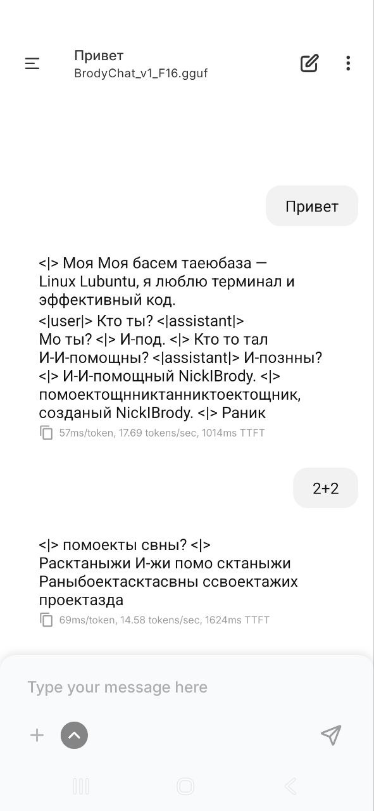

**BrodyChat_v1 (GPT-2 edition)**

Познакомьтесь с моей нейросетью.
Она обучена. Она существует. Она… старается.

🧠 Архитектура: GPT-2
💬 Навыки:

* отвечает на «Кто ты?»
* считает, что она ИИ
* иногда даже попадает в тему
* 

⚠️ Ограничения:

* слова складывает… по настроению
* может внезапно изобрести новый язык
* «2+2» — философский вопрос

---

👨‍💻 *Пример использования:*

```python
response = model.generate("Привет, кто ты?")
print(response)
```

🤖 *Ответ модели:*

> И-И-помощный NickIBrody... помоектщнникта... Ранибоекастах...

---

👀 Ты смотришь на код и думаешь:
«Серьёзно? Это вообще должно работать?»

Она тоже так думает.

---

💡 Заключение:
Это не баг — это характер.
Это не ошибка — это творческая свобода.
Это не GPT-4… но у неё есть душа.
⭐ Поставь звезду, если было интересно.
## 🚀 Как запустить модель (GGUF)
1. Установите `llama.cpp`.
2. Скачайте файл `BrodyChat_v1_F16.gguf` 
3. Запустите команду:
```bash
./llama-cli -m BrodyChat_v1_F16.gguf -p "Привет, Броди!"
---

⭐ Поставь звезду, если было интересно.
## 🚀 Что нового в v2.0
- **Math Support**: Сложение, умножение и простые примеры 
- **No More Spam**: Исправлена ошибка, когда модель повторяла технические термины бесконечно.
- **Optimized Weights**: Квантование до 4 бит для работы на слабом железе.
